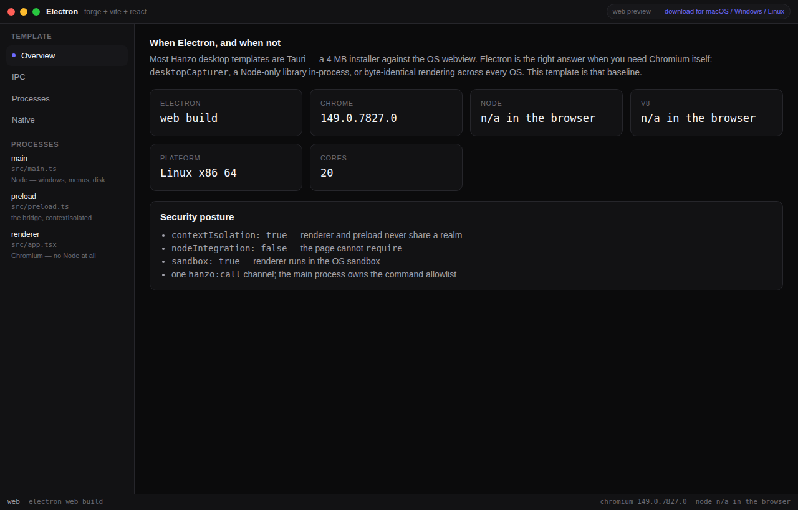

# Electron

Electron 43 + Forge + Vite + React baseline — contextIsolated IPC, native dialogs, app metrics, frameless chrome.

A **Hanzo desktop template**: one codebase, three installers (macOS, Windows,
Linux) and a web build. Fork it, `npm i`, ship.

- Live web preview: <https://desktop-electron.hanzo.app>
- Installers: <https://github.com/hanzo-templates/desktop-electron/releases/latest>
- Source: <https://github.com/hanzo-templates/desktop-electron>



## Why this exists

A native app cannot be iframed, so the gallery preview is a *real* build of the
same UI — not a screenshot and not a dead link. `src/native.ts` is the only file
that knows whether it is running inside Electron or a browser tab;
everything above it is one app.

## Stack

| Layer    | Choice |
| -------- | ------ |
| Shell    | Electron 43 + Forge (bundled Chromium — chosen only where a Chromium-only API is the point) |
| UI       | React 19 + Vite 7 + TypeScript |
| Backend  | [`@hanzo/base`](https://www.npmjs.com/package/@hanzo/base) — collections, realtime, CRDT |
| Runtime  | `a.hanzo.ai` analytics + chat, loaded from `index.html` |
| Native   | main-process IPC allowlist, OS dialogs, notifications, `app.getAppMetrics()`, extra BrowserWindows |

## Run

```bash
npm install
npm run desktop        # Electron dev window
npm run dev            # browser, same UI, web fallbacks
npm run make           # installers for the host OS -> out/make
npm run build          # static web build -> dist/
```

Linux make deps: `rpm fakeroot dpkg`.

## Backend

`src/base.ts` points at `https://base.hanzo.ai`. Point a fork at its own with
`VITE_BASE_URL`. Base is optional — the app renders and works offline, the
status bar just says so.

## Release

Push a `v*` tag. `.github/workflows/release.yml` fans out to macOS,
Windows and Linux runners and attaches `.zip` / `.exe` / `.deb` / `.rpm` to the
GitHub release. Desktop bundles must be built on their
target OS, which is why this one workflow uses per-platform runners.

## Upstream & license

Scaffold derived from **electron-forge vite-typescript template** (https://github.com/electron/forge), MIT.
This template is MIT — see [LICENSE](./LICENSE). Every dependency is
MIT/Apache-2.0/BSD; nothing copyleft is pulled in, so a fork can be
commercialised without contaminating it.
